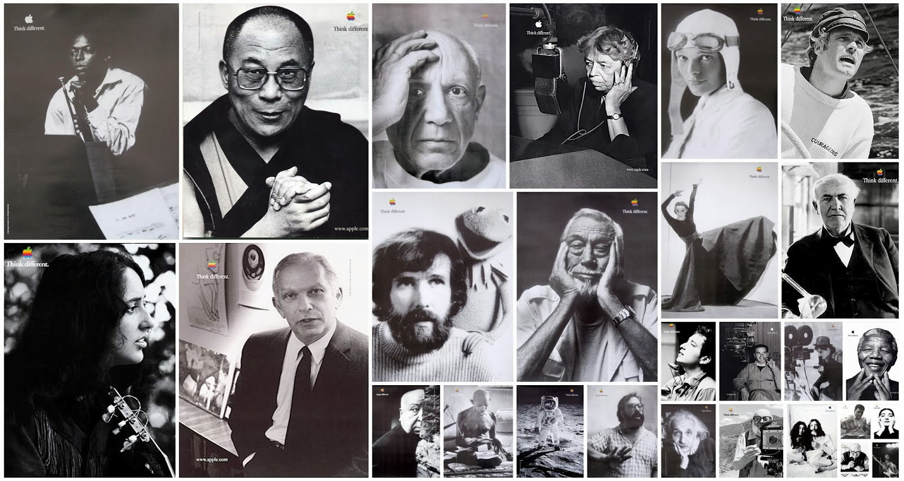

## 👋 Hi, I'm Almer

I’m a Frontend Engineer with 2.5 years of experience building web applications that balance performance, usability and design. I started my career in 2022, and since then I’ve collaborated with teams on projects that sharpened my expertise.

What excites me most about software development is the bridge between logic and experience. I appreciate good design, like to build things and have a passion for continuous learning. Clean code matters to me, but so does accessibility, responsiveness and making sure every interaction feels natural.

I approach my work with curiosity and care. For me, frontend development isn’t just about pushing pixels or shipping features—it’s about crafting experiences that make life easier, faster and a little more delightful.

I’ve learned that the best frontend engineers don’t just write code; they listen, adapt and collaborate. They bring structure to complexity and creativity to constraints. That’s the kind of engineer I strive to be every day.

---

### About Me
- 🧑‍💻 Working as a Frontend Software Engineer @ **Apteum**
- ⚙️ Learning **backend development** and exploring **DevOps**
- 📐 Passionate about writing **clean, maintainable code** that’s easy to scale

### Interests
- 🎮 Strategy, role-playing, and puzzle games — *The Legend of Zelda, Company of Heroes, Call of Duty: Modern Warfare series*
- 📖 Philosophy, intentional living and continuous self-improvement
- 🐾 Working dogs (yes, really)
- 🏃‍♂️ Running — *building strength and endurance*

### Let's Connect
Got a question, or just want to say hello? Hit me up! Have a proposal or project in mind? Let's collaborate! You can reach out via [LinkedIn](https://www.linkedin.com/in/almertampus/) or [Email](almerflorestampus@gmail.com)

### Statistics

### "Think Different"
#### (A nod to Apple's iconic campaign)

> Here's to the crazy ones. The misfits. The rebels. The troublemakers. The round pegs in the square holes. The ones who see things differently. They're not fond of rules. And they have no respect for the status quo.
>
> You can quote them, disagree with them, glorify or vilify them. About the only thing you can't do is ignore them. Because they change things. They push the human race forward.
>
> And while some may see them as the crazy ones, we see genius. Because the people who are crazy enough to think they can change the world, are the ones who do.

