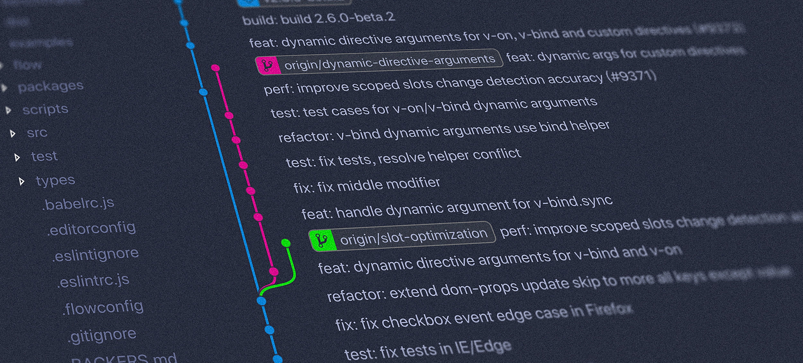
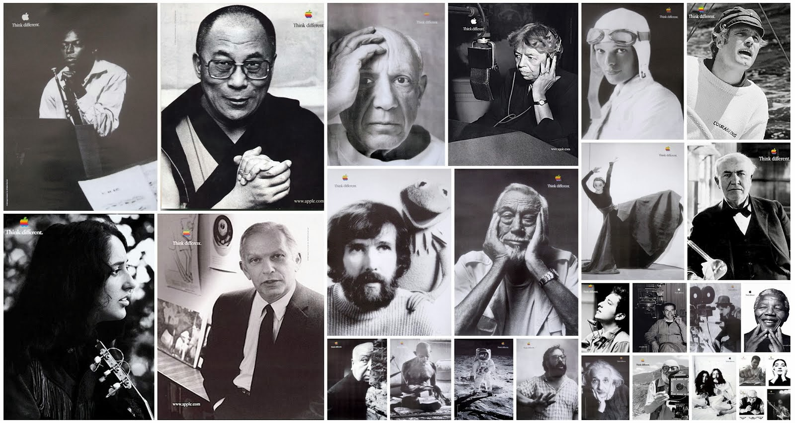

## Hi, I'm Almer 👋

A software engineer with 2 years of professional experience, specializing in front-end web development. Proficient in TypeScript and JavaScript, and excels in harnessing the power of modern frameworks and libraries such as React and Next.js, and CSS frameworks like MUI, Ant Design, Tailwind, Chakra UI and Bootstrap.

- 💻 Frontend Developer @ Apteum (Landchecker team)
- 🌱 Learning backend development and DevOps
- 💬 Ask me anything related to TypeScript, React, Clean Code, Working Dogs

Got a question, or just want to say hello? Hit me up! Have a proposal or project in mind? Let's collaborate!

### "Think Different" (A nod to Apple's iconic campaign)

> Here's to the crazy ones. The misfits. The rebels. The troublemakers. The round pegs in the square holes. The ones who see things differently. They're not fond of rules. And they have no respect for the status quo. You can quote them, disagree with them, glorify or vilify them. About the only thing you can't do is ignore them. Because they change things. They push the human race forward. And while some may see them as the crazy ones, we see genius. Because the people who are crazy enough to think they can change the world, are the ones who do.
