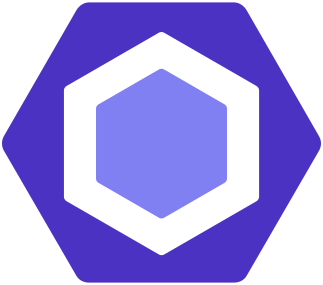
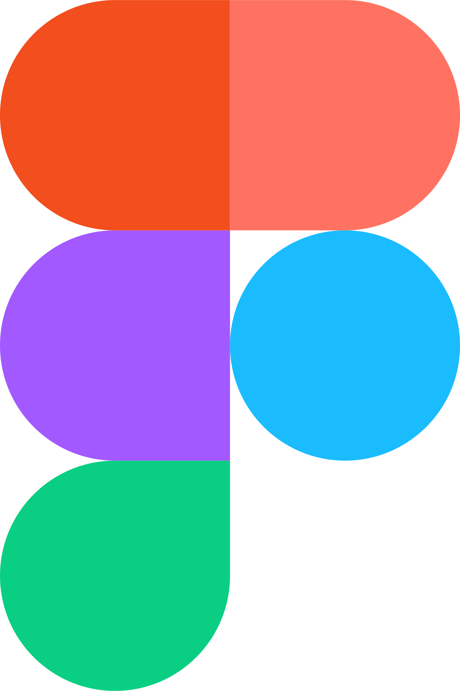

#### Tech Stack

  
  
  
  
  
  
  
  
  
  
  
  
  
  
  
  
  
  
  
  
  
  
  
  

## Hi, I'm Almer 👋

A frontend developer with 1+ years of professional experience, a lifelong learner and a working dog enthusiast. Expertise lies in building web applications using a versatile tech stack. Proficient in JavaScript and TypeScript, and excels in harnessing the power of modern frameworks and libraries, such as React, Next.js, Redux, Zustand, and CSS frameworks like Tailwind, Chakra UI and Bootstrap.

## What's Happening?
- Ex-Frontend Developer @ Seaplane Group and Highly Succeed Inc.
- Mastering React + TypeScript
- Exploring software automation testing and test-driven development
- Grinding DSA challenges on HackerRank
- Researching best practices, design patterns and clean code

## Statistics

## Get In Touch
Got a question, or just want to say hello? Hit me up! Have a proposal or project in mind? Let's collaborate!

You can reach me via [almerflorestampus@gmail.com](mailto:almerflorestampus@gmail). You can also check out my [portfolio website](https://almertampus.xyz).

